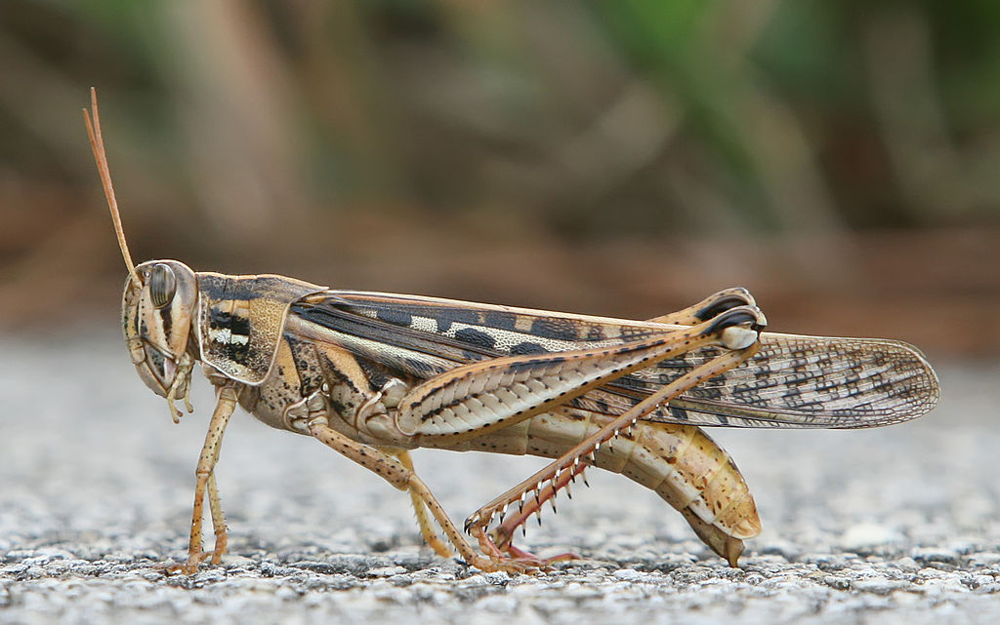

# ex1
grasshopper

About the animal [Grasshopper]
https://en.wikipedia.org/wiki/Grasshopper

Important to know:
Grasshoppers are insects of the suborder Caelifera within the order Orthoptera, which includes crickets and katydids (bush crickets). They are sometimes referred to as short-horned grasshoppers to distinguish them from the katydids, which have much longer antennae. They are probably the oldest living group of chewing herbivorous insects, dating back to the early Triassic around 250 million years ago. Grasshoppers are typically ground-dwelling insects with powerful hind legs which enable them to escape from threats by leaping vigorously. They are hemimetabolous insects (they do not undergo complete metamorphosis) which hatch from an egg into a nymph or "hopper" which undergoes five moults, becoming more similar to the adult insect at each developmental stage. At high population densities and under certain environmental conditions, some grasshopper species can change colour and behaviour and form swarms. Under these circumstances they are known as locusts.

Found especially in:
Everywhere in the world.

Image:

  
</p

Species:
Morabidae, Tetrigidae, Acridoidea, Catantopidae...

